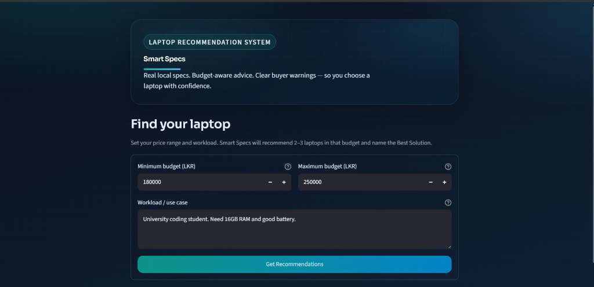
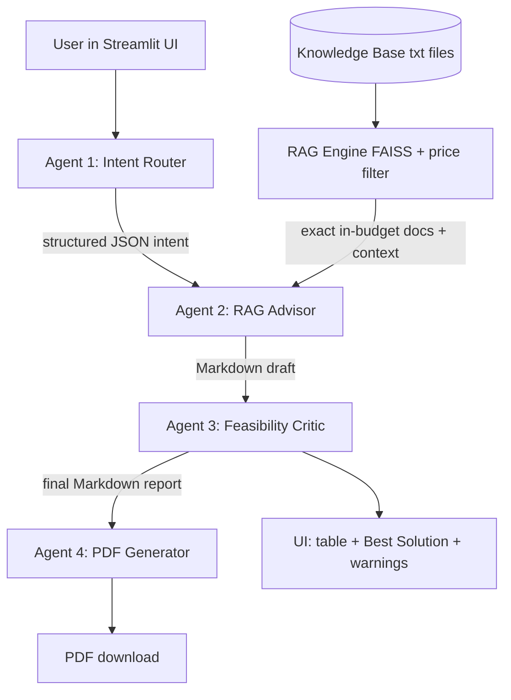
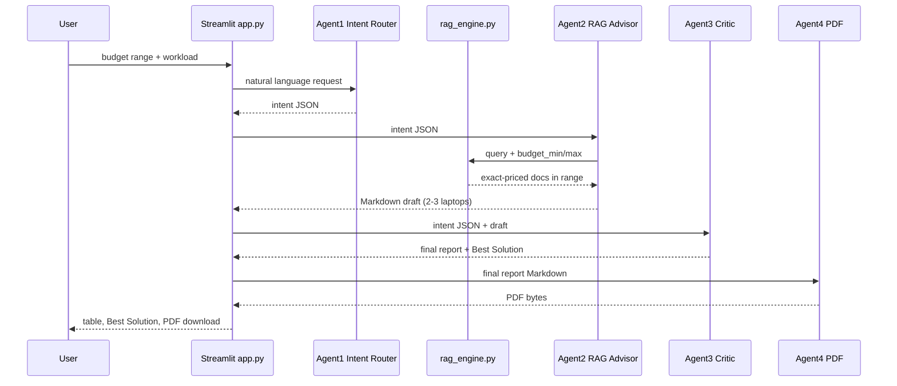

# Smart Specs — Agentic AI Laptop Advisor

An agentic AI system that recommends laptops for **Sri Lankan students and buyers** using real local-style price/spec documents, a multi-agent pipeline, and RAG — not a generic chatbot that invents specs.



**Live app:** [https://smartspecs-advisor.streamlit.app/](https://smartspecs-advisor.streamlit.app/)  
**Demo video:** [https://youtu.be/x8qq0PQCq_w](https://youtu.be/x8qq0PQCq_w)

---

## 1. Problem (Option A — Real-world)

Students often get poor laptop advice:

- fake or outdated specs
- prices that ignore the local market (LKR)
- recommendations that miss budget and workload needs

**Smart Specs** solves this by retrieving from a domain knowledge base of laptop listings and workload guides, then auditing recommendations for budget fit and buyer risks.

---


## 2. Solution overview

Four cooperating components:


| Agent                        | Role                                          | Pattern                 |
| ---------------------------- | --------------------------------------------- | ----------------------- |
| Agent 1 — Intent Router      | Parses budget + workload into structured JSON | **Router**              |
| Agent 2 — RAG Advisor        | Retrieves docs + drafts 2–3 recommendations   | **Tool-use / RAG**      |
| Agent 3 — Feasibility Critic | Audits budget fit, warnings, Best Solution    | **Reflection**          |
| Agent 4 — PDF Generator      | Creates downloadable PDF report               | **Tool / worker**       |
| `pipeline.py` / `app.py`     | Runs agents in order                          | **Orchestrator-worker** |


Final UI output:

- comparison table (2–3 laptops)
- highlighted **Best Solution**
- buyer warnings
- PDF download

---


## 3. Setup


### Prerequisites

- Python 3.10+
- Groq API key ([console.groq.com](https://console.groq.com))
- Optional: OpenRouter API key (if using `AGENT2_PROVIDER=openrouter`)


### Local install

```bash
git clone https://github.com/HiranyaPahasara/agentic-laptop-advisor.git
cd agentic-laptop-advisor
python -m venv venv

# Windows PowerShell
.\venv\Scripts\Activate.ps1

pip install -r requirements.txt
```


### Environment variables

Create a local `.env` file (never commit it):

```env
GROQ_API_KEY=your_groq_key
OPENROUTER_API_KEY=your_openrouter_key
AGENT2_PROVIDER=groq
```

For Streamlit Cloud, add the same keys under **App settings → Secrets**.

### Run

```bash
# Optional: rebuild FAISS index after adding docs
python -c "from rag.rag_engine import retrieve_context; print(retrieve_context('16GB coding laptop', rebuild=True, budget_min=200000, budget_max=250000))"

streamlit run app.py
```

Open `http://localhost:8501`.

---


## 4. Project structure

```text
agentic-laptop-advisor/
├── app.py                      # Streamlit UI (orchestrator entry)
├── pipeline.py                 # 1→2→3→4 pipeline helper
├── requirements.txt
├── agents/
│   ├── intent_router.py        # Agent 1 (Router, Groq)
│   ├── rag_advisor.py          # Agent 2 (RAG + drafting)
│   ├── feasibility_critic.py   # Agent 3 (Reflection/critic)
│   └── pdf_generator.py        # Agent 4 (PDF tool)
├── rag/
│   ├── rag_engine.py           # FAISS + exact budget filter
│   └── test_rag.py             # Retrieval smoke tests
├── data/knowledge_base/        # 70+ domain .txt documents
├── reports/                    # Generated PDFs (ignored)
└── docs/smart-specs-ui.png     # UI screenshot
```

Ignored locally (see `.gitignore`): `.env`, `venv/`, `faiss_index/`, `reports/*.pdf`, `.streamlit/secrets.toml`.

---


## 5. Architecture diagram




---


## 6. Sequence diagram (agent communication)

Agents exchange **structured messages**:

- Agent 1 → Agent 2: JSON intent (`budget_min`, `budget_max`, `workload`, …)
- Agent 2 → Agent 3: Markdown draft table
- Agent 3 → UI/PDF: audited final Markdown (includes Best Solution)




---


## 7. Agentic design patterns (explicit locations)


| Pattern                 | Location                                     | How it is used                                               |
| ----------------------- | -------------------------------------------- | ------------------------------------------------------------ |
| **Router**              | `agents/intent_router.py`                    | Routes free text into schema JSON for downstream agents      |
| **Tool-use / RAG**      | `rag/rag_engine.py`, `agents/rag_advisor.py` | Retrieves domain docs / exact price matches before reasoning |
| **Reflection**          | `agents/feasibility_critic.py`               | Critiques draft, flags risks, selects Best Solution          |
| **Orchestrator-worker** | `pipeline.py`, `app.py`                      | Coordinates Agent 1→2→3→4 as workers                         |


This satisfies **≥3 distinct patterns**.

---


## 8. Model selection comparison


| Task                    | Provider / Model                                        | Why chosen                            | Latency   | Cost                       | Reasoning quality          |
| ----------------------- | ------------------------------------------------------- | ------------------------------------- | --------- | -------------------------- | -------------------------- |
| Agent 1 Intent parsing  | **Groq** `llama-3.1-8b-instant`                         | Fast structured JSON extraction       | Low       | Free tier friendly         | Good for short parsing     |
| Agent 2 Recommendations | **Groq** `llama-3.3-70b-versatile` (default)            | Stronger drafting/table quality       | Medium    | Free tier friendly         | Higher quality than 8B     |
| Agent 2 (optional)      | **OpenRouter** e.g. `meta-llama/llama-3.3-70b-instruct` | Swap via `AGENT2_PROVIDER=openrouter` | Medium    | Paid/credits may be needed | Comparable drafting        |
| Agent 3 Critic          | **Groq** `llama-3.1-8b-instant`                         | Quick audit + warnings                | Low       | Free tier friendly         | Enough for critique format |
| Embeddings (RAG)        | `sentence-transformers/all-MiniLM-L6-v2`                | Local, no API key                     | Local CPU | Free                       | Good for short spec docs   |


**Two different LLMs are used for different sub-tasks** (8B router/critic vs 70B advisor). OpenRouter integration is implemented for Agent 2 when credits are available.

---


## 9. RAG pipeline


### Corpus

- Folder: `data/knowledge_base/`
- Size: **70+** `.txt` documents
- Domain: Sri Lankan-style laptop listings (exact LKR prices), workload guides, buyer warnings, budget shortlists


### Pipeline steps

1. Load `.txt` documents
2. Chunk with recursive splitter
3. Embed with MiniLM
4. Store/search with **FAISS**
5. **Exact budget filter**: when user sets min/max, only listings with `Price: LKR ...` inside that range are used for recommendations


### Key code

- Build/search: `rag/rag_engine.py`
- Used by Agent 2: `agents/rag_advisor.py`

---


## 10. RAG 5-query retrieval evaluation

Evaluation method: run retrieval and check whether top results are relevant to the query intent.


| #   | Query                                             | Expected relevant content                                                                  | Relevant? |
| --- | ------------------------------------------------- | ------------------------------------------------------------------------------------------ | --------- |
| 1   | `coding student 16GB RAM budget 230000 to 250000` | Exact-priced 16GB / student coding laptops in range (e.g. Vivobook 233900, HP 250R 239900) | Yes       |
| 2   | `budget gaming laptop with RTX GPU`               | Gaming docs (Victus / TUF / LOQ / RTX listings)                                            | Yes       |
| 3   | `warnings about soldered RAM and battery life`    | `hardware_buyer_warnings.txt` and related limitation notes                                 | Yes       |
| 4   | `video editing requirements 16GB RAM`             | `video_editing_requirements.txt` + higher RAM/GPU candidates                               | Yes       |
| 5   | `laptop under 200000 LKR Windows 11`              | Exact listings under 200k (e.g. HP 15-fd1315TU 195900, Vivobook Go options)                | Yes       |


Reproduce locally:

```bash
python -m rag.test_rag
python -c "from rag.rag_engine import get_laptops_in_budget; print(get_laptops_in_budget(230000,250000,'coding 16GB',5))"
```

---


## 11. How to use the app

1. Set **Minimum** and **Maximum** budget (LKR)
2. Enter a real workload (e.g. `University coding student. Need 16GB RAM and good battery.`)
  - Greetings like “Hi how are you” are rejected
3. Click **Get Recommendations**
4. Review:
  - highlighted **Best Solution** (shown once at the top)
  - comparison table of 2–3 laptops inside your price range
  - buyer warnings
5. Download the PDF report

---


## 12. GitHub workflow used

Feature branches + Pull Requests into `main`:

- `feature/rag-engine`
- `feature/agent1-router`
- `feature/agent2-advisor`
- `feature/agent3-critic`
- `feature/agent4-pdf`
- `feature/frontend-ui`

Semantic commits used throughout (`feat:`, `fix:`, `data:`, `docs:`, `chore:`, `test:`).

---


## 13. Deployment (Streamlit Community Cloud)


### Before deploy

1. Merge latest feature work into `main`
2. Push `main` to GitHub
3. Confirm `app.py`, `requirements.txt`, `agents/`, `rag/`, and `data/knowledge_base/` are on GitHub
4. Do **not** commit `.env` or `venv/`


### Deploy steps

1. Open [https://share.streamlit.io](https://share.streamlit.io) and sign in with GitHub
2. Click **Create app** / **New app**
3. Select:
  - **Repository:** `HiranyaPahasara/agentic-laptop-advisor`
  - **Branch:** `main`
  - **Main file path:** `app.py`
4. Click **Deploy**
5. Go to **Settings → Secrets** and add:

```toml
GROQ_API_KEY = "your_real_groq_key"
OPENROUTER_API_KEY = "your_openrouter_key"
AGENT2_PROVIDER = "groq"
```

1. Wait for the build to finish (first build can take several minutes)
2. Open the live URL and test budget range + recommendations + PDF download
3. Paste the live URL at the top of this README (replace the placeholder), then commit:

```bash
git add README.md
git commit -m "docs: add Streamlit Community Cloud live app link"
git push origin main
```


### Keep it live

- Keep the Cloud app running for **at least 2 weeks after the deadline**
- If it sleeps, open the URL once to wake it


### Common deploy issues


| Problem            | Fix                                               |
| ------------------ | ------------------------------------------------- |
| API/key errors     | Check Streamlit Secrets names match exactly       |
| Module not found   | Ensure package is in `requirements.txt`, redeploy |
| Slow first request | Normal while embedding model / index warms up     |
| Build failed       | Open Manage app → Logs and fix the shown error    |


---


## 14. Limitations

- Prices are approximate market listings and can change
- Some older docs use price ranges; exact matching prefers `Price: LKR ...` listings
- Free LLM tiers can rate-limit or change model availability
- OpenRouter free models may be unavailable without credits
- ARM/Snapdragon software compatibility is not fully validated automatically
- Recommendations depend on knowledge-base coverage; missing SKUs cannot be invented correctly
- Not financial/purchase advice — always verify with sellers before buying
- Invalid workload text (greetings) is blocked in the UI

---


## 15. Academic integrity note

This project is designed to be explained in viva:

- architecture and agent roles
- why RAG is used instead of pure LLM memory
- where each design pattern lives in code
- how budget filtering prevents out-of-range recommendations

Be ready to modify a prompt, document, or UI field live during demo.

---


## License / course use

Built as a course project: **Agentic AI Laptop Recommendation System (Smart Specs)**.


